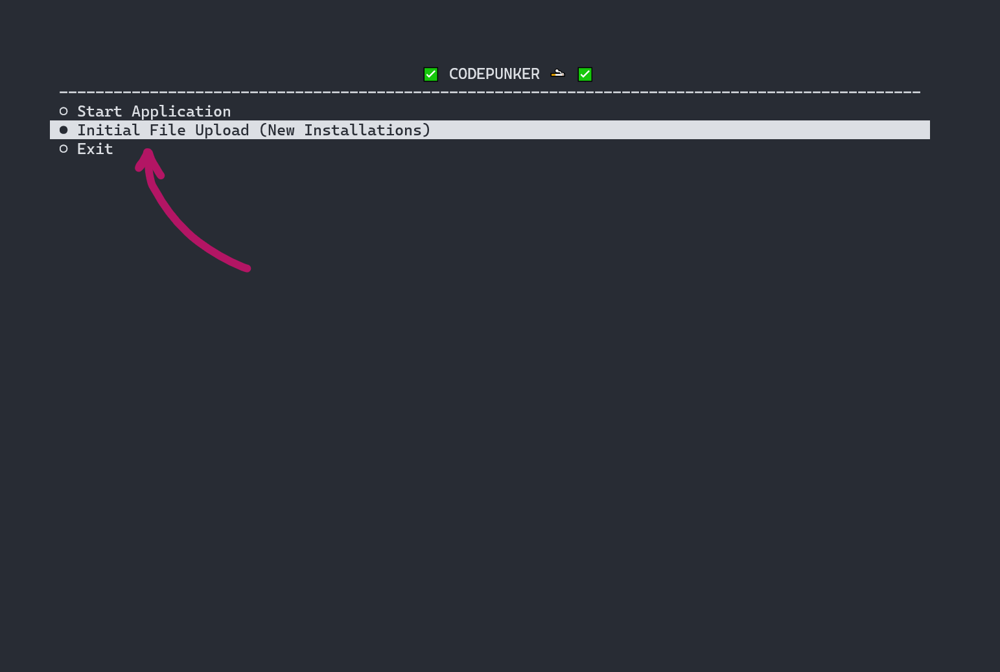

# My Encrypted Access

A command line tool written in PHP that allows storage, retrieval, and content search in an encrypted file in Google Drive. It also acts as a TOTP app. It's main focus is to allow people that have a "passwords" file stored in Google Drive or even on their desktop to safely store it and have easy access to its content. I wrote it to protect some sensitive data.

## Installation and Usage
* Make sure you have php installed and fire up the project in your desired folder
	`git clone https://github.com/the-codepunker/my-encrypted-access.git . && composer install`

* Create your own project on the Google Cloud Platform (https://console.cloud.google.com/apis) and enable the Google Drive API. 

* Generate an OAuth 2.0 Client ID, download the client secret and client ID JSON file in the app folder and name it `secret.json`.

* Place you 'sensitive' file in the app folder and name it `my_encrypted_access.txt`

* Run `php access.php` and go through the "authorization process"... 
	1. A url will be generated in the command line - use that to grant access
	2. Google will generate a token which you can paste back into the command line

* Once authorized, you will be asked "What to do next ?". The first step is to encrypt the local file and push it to drive.

* The app is built as a "step by step" wizard... so just follow the instructions...

## If you are not a developer or don't know what you are doing do not use this!

Donations are welcome: 

	ETH :: 0x9335fE2BCdca68407ed5Ae5FB196d2c69CAf96Da
